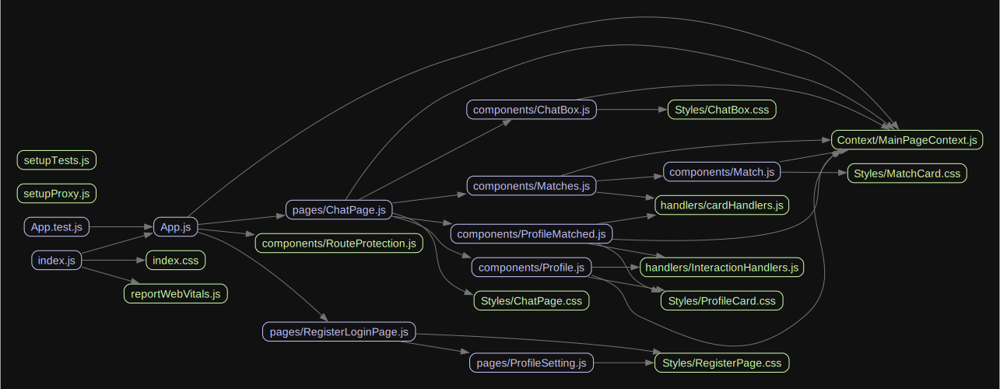

# Advanced Web Development Tinder Project

This project has been created as the final project for the Advanced Web Development course at the [LUT university](https://www.lut.fi/en).

## 1. How to run

### 1.1. Prerequisites

- Node
- npm, npx
- MongoDB

### 1.2. Database import and MongoDB setup

- Import the database from the `Database` folder to your MongoDB instance using the command:

  > mongorestore --db testdb /path/to/decompressed/directory

- Start the MongoDB instance:
  > mongod

### 1.3. Running the server

1. From the main project folder, run `npm run preinstall` to install the required packages for the server
   > **IMPORTANT:** Make sure the database is running before starting the server.
2. Run `npm run dev:server` to start the server. It will run by default on the port 1234
   > 

### 1.4. Running the client

1. From the main project folder, run `npm run install` to install the required packages for the client

2. Run `npm run dev:client` to start the client. It will run by default on the port 3000
   > 

Now the project should be running on the port 3000. You can access it by going to [http://localhost:3000](http://localhost:3000)

## 2. Project structure

The project is divided into two main folders: `client` and `server`. The `client` folder contains the front-end part of the project, while the `server` folder contains the back-end part of the project.

### 2.1. Client

The client is a React application that uses the `create-react-app` template. It is divided into the following folders:

- `src/components`: Contains the main components of the application
- `src/pages`: Contains the main pages of the application
- `src/Context`: Contains the context used to manage the state of the application
- `src/handlers`: Contains the handlers used to manage the interactions in the app and server requests
- `src/Styles`: Contains the styles used in the application
- `src/userImages`: Contains a powershell script to generate the user images, mainly used for testing purposes in the cypress tests
- `Cypress/e2e`: Contains the cypress tests

### 2.2. Server

The server is a Node.js application that uses the `express` framework. It is divided into the following folders:

- `configFiles`: Contains the configuration files for passport and the validation rules used in the login and register forms
- `models`: Contains the models used to interact with the database.
- `routes`: Contains the routes used in the application. Specifically, the routes have been divided into the following files:
  - `user`: Contains the routes related to the users
  - `matches`: Contains the routes related to the matches/interactions
  - `chats`: Contains the routes related to the chat
  - `index`: Contains the main routes of the application

## 3. Database structure

The database is a MongoDB database. It is divided into the following collections:

- `chats`: Contains the chats between users. It has the following structure:
  - `userID1`: The id of the chat
  - `userID2`: The users that are part of the chat
  - `messages`: The messages of the chat
    - `senderID`: The id of the user that sent the message
    - `content`: The content of the message
    - `timestamp`: The date and time the message was sent
- `images`: Contains the images of the users. It has the following structure:
  - `profileImg`: The profile image of the user in buffer format
    > The image \_id in the collection is the same as the user \_id since the user \_id is unique and only one image is allowed per user
- `interactions`: Contains the interactions between users. It has the following structure:

  - `userID1`: The id of the user that liked the other user
  - `userID2`: The id of the user that was liked
  - `interactionStatus`: The status of the interaction. It can be:
    - `like`: Both users liked each other (Match)
    - `dislike`: One user disliked the other user
    - `pending`: One user liked the other user, but the other user hasn't liked or disliked back yet
  - `chatId`: The id of the chat between the users. It's only set when the interactionStatus is `like`
  - `timestamp`: The date and time the interaction was created

- `users`: Contains the users of the application. It has the following structure:
  - `name`: The name of the user
  - `surname`: The surname of the user
  - `email`: The email of the user
  - `password`: The password of the user
  - `bio`: The bio of the user

## 4. Dependencies

The dependencies structure of the project pages and components is as follows:

created using [madge library](https://www.npmjs.com/package/madge?activeTab=readme) in combination with [graphviz](https://graphviz.org/)

## 5. Basic UI draft

## 6. Cypress tests

The cypress tests are located in the `client/Cypress/e2e` folder. They are divided into the following files:

### 6.1. Tests structure

- `ChatPage`: Contains the tests related to the chat page and are structured as follows:
  - `Like a random user`: Tests the like functionality
  - `Dislike a random user`: Tests the dislike functionality
  - `Open matched Profile`: Tests opening a matched user profile
  - `Open chat with a matched user`: Tests opening a chat with a matched user
  - `Send message`: Tests sending a message to a matched user
  - `Logout`: Tests the logout functionality
- `RegisterLoginPage`: Contains the tests related to the register and login pages and are structured as follows:
  - `Fill registering form`: Fill the registering form and submits it
  - `Register a new user`: Fills the registering form, creates a new image using the powershell script and submits the form
  - `Login with registered user`: Using the user created in the previous test, logs in
- `UsersCreation`: Contains two tests that create 7 new users and creates basic interactions between them to initialize the database using dynamic data generated with the library [Faker.js](https://fakerjs.dev/guide/) and the powershell script I created to create the image
  - `Create users`: Creates seven users using dynamic data following the registering flow
  - `Set Initial Database`: Creates interactions between the users to initialize the database, specifically:
    - 1 user likes all other users reciprocally (matches everyone) so pagination can be tested (5 max per page)
    - 2 users send messages to each other
    - 1 user dislikes another user

### 6.2. Running the tests

#### 6.2.1. Running the tests using npm commands

The following commands must be run from the main project folder

- `npm run frontTests` will run both ChatPage and RegisterLoginPage tests graphically
- `npm run setUpDB` will run the UsersCreation tests to initialize the database with dynamic data

#### 6.2.2. Running the tests using the cypress cli

The following commands must be run from the `client` folder and are just examples:

- `npx cypress run --e2e` to run all e2e tests mentioned before
- `npx cypress run --spec "cypress/e2e/ChatPage.cy.js,cypress/e2e/RegisterLoginPage.cy.js"` to run just the ChatPage tests for example

> **IMPORTANT** by default all tests are run headlessly, to run them in the browser use the `--headed` flag. (the npm commands I created already include this flag)

For more options look into the cypress cli documentation [here](https://docs.cypress.io/guides/guides/command-line)

## 7. Functionality aclarations

- `Responsiveness`: The application is responsive although the design is pretty basic and under 500 px the UI realigns to be more practical
- `Pager`: The pager is set to allow 5 users per page, this is due to the design and the fact that 10 users per page would not fit
- `Lack of users`: If no more users to interact with are found, the application will display a message in the profile card stating so.
- `Potential matches`: While swipping, the users that have liked the current user will be displayed first until there are no more when they will start again to be displayed in a random order
- `Disliked users`: The users that have been disliked will not be displayed to the current user again as well as the users that have disliked the current user

## 8. Completed Features

- **Mandatory requirements**:
  - **Authentication**: The user can register and login to the application and the password is hashed using bcrypt creating an authentication token using passport and jwt
  - **User profile**: The user can interact with other users by liking or disliking them and can see the users that liked them. The user can also see the matches and chat with them as well as upload a profile picture
  - **Responsive design**: The application is responsive and can be used in mobile devices
  - **Documentation**: The project has a README file that explains how to run the project, the project structure, the database structure, the dependencies and the cypress tests as well as the code has comments explaining the logic of the code
- **Extra requirements**:
  - **Pager**: The user can see the users that liked them and the matches in a paginated way when is more than 5 users (due to design 10 was too much)
  - **Google login**: The user can login using google since it remembers the user (passport used)
  - **User images**: The user can upload a profile picture on registration and see the profile picture of the users that liked them
  - **Matches profile**: The user can open the profile of the users that liked them
  - **Cypress tests**: The project has cypress tests that test the main functionalities of the application

> **IMPORTANT**: The targeted number of points would be 42, although the project has been submitted late and in a non admisable state hence this is only a guide to be used as a reference
